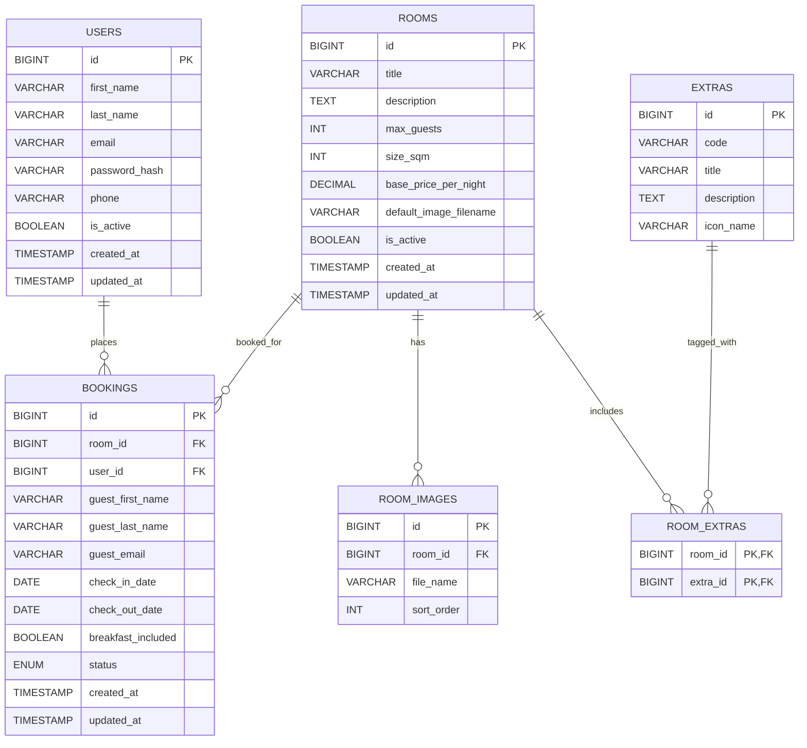

# Initial Database Design

## Scope and Assumptions
- Supports hotel presentation, room listing, availability checking, and booking.
- Bookings store guest details even if the guest is not registered.
- Availability is derived from bookings with `status = 'confirmed'` (optionally include `pending` when reserving during checkout).
- Images are stored on disk; DB stores filenames and ordering only.
- Naming follows `snake_case` per best-practices.

## Mermaid ERD diagram

## Entities

### users
Registered guests for viewing personal details and bookings.
- `id` BIGINT PK
- `first_name` VARCHAR(100) NOT NULL
- `last_name` VARCHAR(100) NOT NULL
- `email` VARCHAR(255) NOT NULL UNIQUE
- `password_hash` VARCHAR(255) NOT NULL
- `phone` VARCHAR(50) NULL
- `is_active` BOOLEAN NOT NULL DEFAULT TRUE
- `created_at` TIMESTAMP NOT NULL DEFAULT CURRENT_TIMESTAMP
- `updated_at` TIMESTAMP NOT NULL DEFAULT CURRENT_TIMESTAMP ON UPDATE CURRENT_TIMESTAMP

### rooms
Core room catalog shown in the UI.
- `id` BIGINT PK
- `title` VARCHAR(150) NOT NULL
- `description` TEXT NOT NULL
- `max_guests` INT NOT NULL
- `size_sqm` INT NULL
- `base_price_per_night` DECIMAL(10,2) NOT NULL
- `default_image_filename` VARCHAR(255) NULL
- `is_active` BOOLEAN NOT NULL DEFAULT TRUE
- `created_at` TIMESTAMP NOT NULL DEFAULT CURRENT_TIMESTAMP
- `updated_at` TIMESTAMP NOT NULL DEFAULT CURRENT_TIMESTAMP ON UPDATE CURRENT_TIMESTAMP

### room_images
Optional image gallery per room.
- `id` BIGINT PK
- `room_id` BIGINT NOT NULL FK -> rooms.id
- `file_name` VARCHAR(255) NOT NULL
- `sort_order` INT NOT NULL DEFAULT 0

### extras
Selectable extras displayed with icons.
- `id` BIGINT PK
- `code` VARCHAR(50) NOT NULL UNIQUE
- `title` VARCHAR(100) NOT NULL
- `description` TEXT NULL
- `icon_name` VARCHAR(100) NOT NULL

### room_extras
Many-to-many relationship between rooms and extras.
- `room_id` BIGINT NOT NULL FK -> rooms.id
- `extra_id` BIGINT NOT NULL FK -> extras.id
- PK (`room_id`, `extra_id`)

### bookings
Stores reservation details and guest contact data.
- `id` BIGINT PK
- `room_id` BIGINT NOT NULL FK -> rooms.id
- `user_id` BIGINT NULL FK -> users.id
- `guest_first_name` VARCHAR(100) NOT NULL
- `guest_last_name` VARCHAR(100) NOT NULL
- `guest_email` VARCHAR(255) NOT NULL
- `check_in_date` DATE NOT NULL
- `check_out_date` DATE NOT NULL
- `breakfast_included` BOOLEAN NOT NULL DEFAULT FALSE
- `status` ENUM('pending', 'confirmed', 'cancelled') NOT NULL DEFAULT 'pending'
- `created_at` TIMESTAMP NOT NULL DEFAULT CURRENT_TIMESTAMP
- `updated_at` TIMESTAMP NOT NULL DEFAULT CURRENT_TIMESTAMP ON UPDATE CURRENT_TIMESTAMP

## Indexes
- `bookings(room_id, check_in_date, check_out_date)` for availability checks.
- `bookings(guest_email)` for lookup by email.
- `room_images(room_id, sort_order)` for gallery ordering.
- `room_extras(extra_id)` for reverse lookup.
