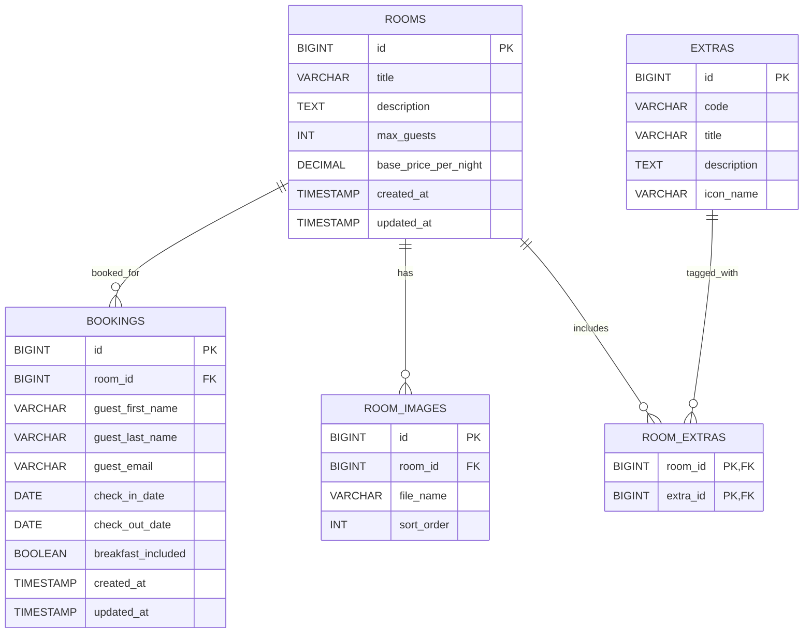

# Initial Database Design

## Scope and Assumptions
- Supports room listing, room details, availability checking, booking, and booking confirmation.
- Bookings store guest details only; no user accounts are required for this minimal implementation.
- A room is unavailable when any existing booking overlaps the requested dates.
- Booking dates use hotel-style ranges: `check_in_date` is inclusive and `check_out_date` is exclusive.
- Each room can have multiple images, and each image belongs to exactly one room.
- Images are stored on disk; the DB stores filenames and ordering only.
- Naming follows `snake_case` per best-practices.

## Mermaid ERD diagram

## Entities

### rooms
Core room catalog shown in the UI.
- `id` BIGINT PK
- `title` VARCHAR(150) NOT NULL
- `description` TEXT NOT NULL
- `max_guests` INT NOT NULL
- `base_price_per_night` DECIMAL(10,2) NOT NULL
- `created_at` TIMESTAMP NOT NULL DEFAULT CURRENT_TIMESTAMP
- `updated_at` TIMESTAMP NOT NULL DEFAULT CURRENT_TIMESTAMP ON UPDATE CURRENT_TIMESTAMP

### room_images
Room image gallery stored on disk with ordering in the DB.
- `id` BIGINT PK
- `room_id` BIGINT NOT NULL FK -> rooms.id
- `file_name` VARCHAR(255) NOT NULL
- `sort_order` INT NOT NULL DEFAULT 0

### extras
Selectable extras displayed with icons.
- `id` BIGINT PK
- `code` VARCHAR(50) NOT NULL UNIQUE
- `title` VARCHAR(100) NOT NULL
- `description` TEXT NULL
- `icon_name` VARCHAR(100) NOT NULL

### room_extras
Many-to-many relationship between rooms and extras.
- `room_id` BIGINT NOT NULL FK -> rooms.id
- `extra_id` BIGINT NOT NULL FK -> extras.id
- PK (`room_id`, `extra_id`)

### bookings
Stores reservation details and guest contact data.
- `id` BIGINT PK
- `room_id` BIGINT NOT NULL FK -> rooms.id
- `guest_first_name` VARCHAR(100) NOT NULL
- `guest_last_name` VARCHAR(100) NOT NULL
- `guest_email` VARCHAR(255) NOT NULL
- `check_in_date` DATE NOT NULL
- `check_out_date` DATE NOT NULL
- `breakfast_included` BOOLEAN NOT NULL DEFAULT FALSE
- `created_at` TIMESTAMP NOT NULL DEFAULT CURRENT_TIMESTAMP
- `updated_at` TIMESTAMP NOT NULL DEFAULT CURRENT_TIMESTAMP ON UPDATE CURRENT_TIMESTAMP

## Constraints
- `bookings.check_out_date > bookings.check_in_date`
- `rooms.max_guests > 0`
- `rooms.base_price_per_night >= 0`
- `room_images.sort_order >= 0`

## Indexes
- `bookings(room_id, check_in_date, check_out_date)` for availability checks.
- `UNIQUE room_images(room_id, sort_order)` for image ordering and to prevent duplicate positions within one room.

## Foreign Key Delete Behavior
- Deleting a room is restricted while bookings reference it.
- Deleting a room cascades to its room images and room extras.
- Deleting an extra is restricted while room extras reference it.
